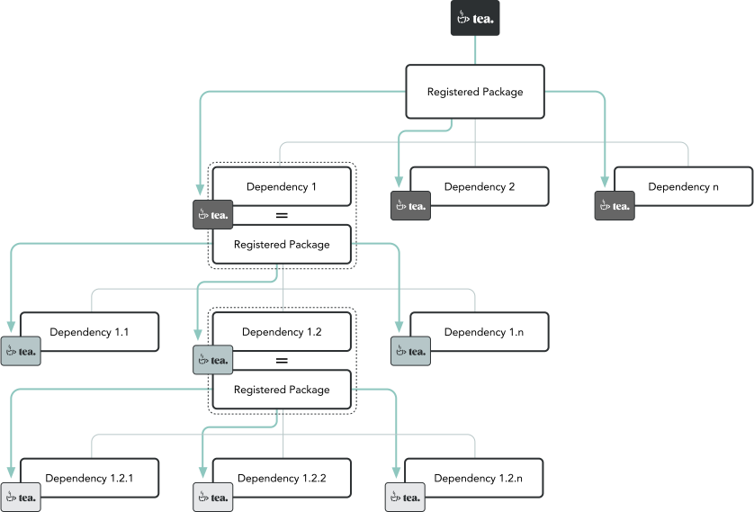

# Tea.xyz：可以用于激励开源生态系统的去中心化协议

本文为<Max Howell  Timothy Lewis  Thomas Borrel>原创，原文地址：https://github.com/teaxyz/white-paper/blob/main/white-paper.md 此版本的中文版，由阿法兔翻译，依据 [CC BY-SA 4.0](https://creativecommons.org/licenses/by-sa/4.0/) 许可证进行授权，转载请附上出处链接，及本声明。

# 声明

本白皮书中列出的信息仍处于初步阶段。因此，本文作者和任职的相关机构，都不需要对下列信息的最终结果或者正确性承担任何责任，本声明适用于法律允许的最大范围内，无论和侵权、合同、或者其他与本白皮书有关的内容，上述作者和任职机构都不需要承担任何责任。本白皮书或其中的任何内容均不得构成与任何合同或承诺有关的基础，也不得作为订立任何合同的原因，本白皮书中的任何内容都不构成对本文讨论的任何代币的销售推销。如果本白皮书在某些司法管辖区域，需要有关部门的许可或注册，那么，本白皮书不计划传递一切和推销有关的观点和信息，特别地，而且截至本白皮书发布之日，本文讨论的任何代币均没有，也无计划根据任何司法管辖区的证券法或相关法律进行登记，如果代币出售将构成违反该司法管辖区的相关法律，那么本白皮书提到的Token不得在任何司法管辖区提供或出售。

# 许可证

本文的源代码，知识共享 版权归属-相同方式共享 4.0 国际公共许可证形式提供。

[^src]: See: @sources
[^cc]: See: @cc

# 引言

互联网主要是由开源项目组成的，自其诞生以来一直如此。随着时间的推移，许多开源项目已经成为今天互联网的基础和基石，所有未来的互联网创新都需要建立在这些基础之上。尽管很多人和公司，都从开源项目建立的互联网基础赚取了财富，但开源项目主要靠的是无偿地创造和维护。

我们坚信，仅靠世界上一小部分工程师选择为爱发电，在需要为工资而奔波，和维护对互联网运行起到重大作用的开源项目之间做出选择，这样的过程会让人类的努力受到阻碍。开源是为爱发电，因此经常会因为缺乏经济激励而受到阻碍，导致真正存在价值的项目永远无法发挥潜力，很多开源项目则会因为维护软件的整个生命周期缺乏激励措施来，而蒙受安全问题。为了充分发挥开源项目的潜力，我们需要为开源生态系统建立一个公平的报酬制度，并且不从根本上改变它的构建和利用方式。

商业企业通会常围绕开源包装商业模式，直接从仁慈的开发人员的工作中获得收入，同时还依靠他们在问题发生时修复错误。一个典型例子是最近的 Log4j 安全漏洞的事件，Log4j 是 Apache 软件基金会旗下的软件包，它在企业和政府使用的许多商业软件和服务发挥着重要作用。2021 年 11 月，一名安全研究员报告了 CVE-2021-442283 漏洞，该漏洞获得了 Apache 软件基金会的最高评分，而 Tenable 的CEO兼美国计算机应急准备小组 (US-CERT) 的创始主席Amit Yoran 将此漏洞描述为“过去十年中最大、最严重的单一漏洞”。

恐慌随之而来，为爱发电去维护这个软件包的志愿者因出现的问题，而受到公开抨击，尽管系统之后得到了修补。但是企业和政府最终也意识到，Log4j，一个被广泛的关键系统使用了 20 年的软件包，是由一些志愿者靠爱发电无偿维护的，这些无名英雄尽管受到行业批判，但他们仍努力采取行动，不知疲倦地修复漏洞。可怕的是，Log4j 并不是唯一的例子。 每周被下载 3000 万次的core-js，是 Node.js 的重要基础，但它也几乎无法得到任何资金支持。近期，还有几位比特币核心开发者宣布辞职，理由之一是大家觉得经济补偿。开源项目在提供激励结构方面已经进行了很多尝试，通常主要是关乎于赞助和赏金系统。赞助模式，使开源用户可以向自己喜欢的项目捐款。

但是，如果我们将开源想象成一座由砖块砌成的高塔，基础层早已被遗大家忘，但仍然有专门的工程师去维护它，这些基础层承载着很多重要的项目，是很多开发者必须要使用的。但是，通常只有塔顶的少量项目是知名的，能够获得赞助。这种带有严重偏见的选择，会导致支撑塔的基础砖块得不到任何捐款和赞助，而最受喜欢的项目和人，收到的赞助却比大家本身需要的要多很多。开源赏金允许项目的用户为开发人员构建特定功能付费，因此，仅奖励项目需要做方面，不一定符合工程师的最佳利益，因为只奖励最受用户喜欢的项目。

本文我们提出了去中心化协议Tea，用于根据开源的开发人员对整个生态系统的贡献公平地给予报酬，并通过tea激励算法应用于tea注册表的所有条目中。

[^1]: Source: @nist
[^2]: Source: @reuters
[^3]: Source: @twitter

# 部分组件

工程师开发一个应用程序需要4个部分：浏览器、终端、编辑器和软件包管理器。在这四样东西中，软件包管理器是控制开发者构建其产品所需的工具和框架的东西，而这一层也是可能改变我们看到改变开源报酬和和激励方式所在之处。

## 软件包管理器

通过软件包管理器，可以明确开发的应用程序的功能依赖于哪些开源软件，无论是最上层，还是底层的基础层。所有对开发应用程序至关重要的组件和版本，都会被记录下来。软件包管理器，可以被独特地放在开发者工具栈中，从而实现基于真实世界应用的自动和精确的价值分配。

本白皮书提出了一个不可篡改的的去中心化注册表，旨在根据算法来分配价值，这种算法决定了每个条目对整个系统的效用和健康的贡献。价值可以从顶点--应用程序和基本库--进入上图中，并被分配给这些顶点的依赖方，因为注册表知道整个开源图表的价值流转方式。

此外，我们认为必须通过软件包管理器提供重要性(实质性)信息(material information)，以便开发者评估他们是否可以信任一个软件包及其开发者。这种信能是基于声誉、社区赞誉、从去中心化身份（DID：参见：https://www.w3.org/TR/did-core/ ）系统中检索的数据、或是其他软件包管理器可能依赖网络参与者，将经济价值置于风险之中的激励机制。

我们相信，tea提供的的工具、信息和奖励的组合将可以公正地激励开发者，帮助激励开源软件的增长，同时促进创新。

[^4]: See: @w3

## 去中心化的注册表

每个包管理器都有自己的包注册表，重复着相同的元数据（Metadata）。现在，是时候需要一个由社区设计，能够单一管理的、全面和明确的注册表了。我们认为，去中心化的、不可篡改的注册表可以提供安全、稳定和防止人为的恶意操作。

我们今天的互联网，运行在数以万计的重要开源组件上。值得注意的是，到目前为止，因移除基本的开源基础设施而引起的事件并不多。

最著名的是2016年NPM left-pad[^5]依赖性的移除，它连累了持续集成和持续部署系统，使开发人员在几天内遇到了一些麻烦。

这一事件表明，互联网建立在脆弱的开发系统之上。

其他的例子还包括软件包的维护者主动或故意破坏自己开发的包（例如color.js，faker.js[^6]，和node-ipc[^7]），或者坏人希望通过假装维护软件包，目的是为了破坏它们，从而窃取比特币的私钥(例如 event-stream[^8])，或者存在恶意拼写错误的软件包，诸如tynosquatting，希望欺骗用户来安装它们的，例如crossenv和cross-env NPM软件包[^npmjsCrossenv]。

随着整个行业都向着数字资产的方向发展，很多东西都会成为软件一部分，因此，软件的完整性需要得到保证。我们不能继续受到恶意行为者修改软件的影响。

但是，大多数包管理器的工具无法保证这些内置在应用程序和dApp，因为其中的软件包是原作者发布的未经修改的开源代码。GitHub发现，17%软件中存在漏洞和被植入了恶意目的[^9]，有些漏洞在很长一段时间内都没有被发现(See Webmin 1.890[^10])。

如果存在去中心化的注册表，再加上一个信誉系统，并存在经济激励机制支持，是否可以暴露坏的软件参与者？并且奖励好的软件参与者？这种方式，也许会为开发者社区提供一直在寻求的关键承诺。

[^5]: Source: @theregister
[^6]: Source: @fossa
[^7]: Source: @lunasec
[^8]: Source: @github
[^npmjsCrossenv]: Source: @npmjsCrossenv
[^9]: Source: @zdnet
[^10]: Source: @threatpost

## 存储系统

开源软件包提供了非常广泛的功能，其中一些可能是受限制的或大家不需要的。加密方式（encryption，这里指密码学里的加密）就是典型的例子。

然而，这项技术也可以被用于邪恶的目的（见Phantom Secure，2018年3月被执法机构拆除[^11]），或者可能会被破坏以支持执法活动（见Operation Ironside（AFP）、Operation Greenlight（Europol）和Operation Trojan Shield（FBI）[^12]，FBI运营一个 "加密的 "通信平台AN0M，并说服罪犯使用他们 "加密的 "手机进行安全通信）。

加密技术的广泛应用使其成为开源软件的完美用例，有一个很好的例子说明，任何存储包的解决方案都必须是防篡改。

tea 是一个去中心化协议，不计划根据其功能对软件包进行干涉、过滤或制裁。虽然 Tea 治理可能会选择删除已证实的恶意软件包（有关这部分更多信息，请参阅治理部分），但关键在于tea系统要与多个存储系统连接，包括证明包未被修改，并且要正确复制去中心化的存储系统，包的维护者可以选择最适合自己需要的存储系统，从而安全地存储和分发这些软件包。

[^11]: Source: @fbi
[^12]: Source: @europol

# 网络的参与者

Tea的愿景在于赋能整个开源社区，确保开源社区的贡献者能够在创造构建互联网的基础工具时得到支持。

在本白皮书中，我们通过参与者的贡献程度来区分他们，有些人会参与代码贡献，有些人会对贡献的代码进行验证，其他人可能会提供经济价值，用于支持开发者和他们的声誉。

## 包维护者

软件包维护者必须确保它的软件能够随着行业的发展，可以继续提供越来越多的价值。

tea会假设软件包创建者会维护自己的工作，软件包维护者是开源社区的支柱，这些开发者需要得到授权，并为持续参与贡献获得激励，因为软件包维护者可能会决定停止维护软件的工作，或者意识到自己并没有办法以符合软件用户所期望的速度工作。当软件包维护者成功提交一个软件包时，会收到一个不可伪造的代币（NFT）（更多细节见NFT部分）。

这个NFT用于证明软件包维护者的工作，也是指导Tea奖励的关键，软件包的NFT的持有者可以转让自己的NFT给其他开发者（或者一个开发群体），从而使新的开发者可以成为软件包的维护者和潜在未来奖励的取得者。

同样地，一个开发者可以承担软件包维护者的角色，他可以将现有的软件包分叉，提交一个新的软件包，让自己成为软件包的创建和维护者。

并且可以为开发者社区提供正确的工具来确定哪些软件包正在被维护，以及确认过去和现在维护声誉和工作质量是至关重要的。

我们经常看到开源贡献被恶意篡改，许多人的努力被作恶者毁掉。尽管恶意的部分很多时候都会被发现，能够得到补救，但往往会到了财务或数据损失而造成重大损失时的那一步，才会被发现。

以EventStream npm包[^13]为例，EventStream 每周被下载超过150万次，并被1500多个包所依赖，当一个黑客设法渗透到该开源项目，获得其原作者的信任，并修改EventStream以依赖一个恶意软件包，将比特币钱包的凭证外泄到第三方服务器。虽然工具可以帮助检测其中的一些攻击，但它们并不总是可靠的。

我们建议通过Tea Token部分，引入激励机制，鼓励开源社区建设性地报告自己的发现，以便软件包维护者能够在问题出出现之前解决这些问题。

[^13]: Source: @medium

## 包用户

软件包用户是专注于解决特定问题的开发人员，开发者们经常会在开源社区寻找他们所需的工具，想要以极少的成本或免费的方式进行技术上的快速实验和迭代，这部分开发者，会直接受益于软件包创建者和维护者的工作。传统情况下，部分人可能会选择通过捐赠或其他形式的报酬来支持开源软件包的维护者，但是捐赠其实还是杯水车薪。

赞助也可以成为支持开源软件开发的有效方式，但是问题在于，赞助得来的报酬通常不会延伸到所有的依赖关系，尽管这种限制有利于赞助者，却会妨碍开源的创新和软件建设，为了让积极和激励能够赋能所有软件开发，无论是初学者还是专家，必须让所有的开发者都可以参与开源。

Tea的目标，是在维护开源软件的核心价值的同时，提供一个去中心化的系统，为维护开源软件包开发者提供报酬。为了实现这一愿景，Tea计划采用开发——激励其他人开发——机制，让软件包的用户能够通过Tea Token的独特应用场景，来支持软件包维护者，这部分可以在本白皮书的Tea Token的未来工作计划以及潜在的社区努力部分看到。

## 包的支持者和赞助方

在Web2.0和Web3中，软件包的支持者通常被称为 "赞助方"。赞助方是使用开源软件来构建商业产品的组织或软件包用户，也希望支持开源生态系统的积极分子，也包括期望资助团队，已开发开发更大系统组件的企业家。

tea提议将软件包支持方的社区，扩展到整个tea社区，无论是组织、开发者、用户还是技术爱好者。tea的目标是通过Tea Token的独特用例来实施去中心化的激励机制，让Tea社区的所有成员，都能为开源的永久可持续性和持续增长作出贡献。软件包的支持者和赞助者，可以根据他们的工作、信仰或任何影响决定的标准和尺度，自由决定要支持哪些软件包或开源软件的维护工程师。此外，软件包支持者和赞助者，提供的支持将流向每个软件包的依赖关系，从而隐含地相信软件包维护者会对他们的堆栈做出良好的选择，并利用这些信息来促进他们的声誉。

只要软件包维护工程师能够提供这样的服务，软件包的赞助方可以收到高级支持级别的NFT作为回报，从而受益于加速的SLA或更灵活的许可。此外，软件包支持者和赞助者可以自主决定支持哪些开源软件包或开源软件包的维护工程师，并自动将全部或一定比例的奖励，转用于激励团队建立新的开源软件。换句话说，软件包不需要存在就可以用tea来激励，新生项目可以和更成熟的项目一样得到支持，进一步激励不断发展的开源环境。

## Tea的试用者

随着新的软件包或现有软件包新版本的发布，需要证明的工作的有效性，因为这些信息，对于取得开源软件的用户信任是非常重要的，用户会决定是否信任开源软件包和它的维护方。在Tea协议中，这一功能是由Tea Taster(鉴定师/品茶师)来承担的。

鉴定师通常是有经验的开发者，他们愿意花一些时间来检查与软件包相关的声明（功能、安全、语义版本[^14]、许可证的准确性等），并以个人的声誉和经济价值为质押，来证明自己的研究和分析结果。在Tea协议中，我们称它为 "Steeping your tea(沏茶）"，即锁定Tea Token，以支持鉴茶师的评价，并根据大家对评论的有效性共识，获得奖励（或惩罚）。

与开源软件包的支持者一样，鉴定师可以影响开源软件包和开源软件包维护者工程师的声誉；然而，鉴于鉴定师验证开源软件包的安全性、功能和质量方面的觉得，他们的影响力更为显著。当然，鉴定师也需要构建自己的声誉，支持他们的主张。鉴定师的工作质量和获得社区的评论，与其他外部数据来源相结合时，将为每个鉴定师的树立自己的声誉，为工作带来更多价值，关于用于影响开源软件包和软件包维护者声誉的机制的更多细节，请参见本白皮书的软件包声誉部分。

[^14]: See: @semver

# 协议概述

设计一个能够激励开放源码贡献的协议是充满挑战的。顾名思义，开源软件是向所有人开放的，因此可能会出现错误的引用、盗用或恶意篡改。然而，开源社区表现出的特质是，它愿意彰显好的社区参与者，揭露坏的社区参与分子。从开源社区的历史上来看，对其他开发者的代码贡献进行审查和评论所花费的精力是完全自愿的，尽管报告和捍卫代码审查结果是非常耗时，又是非常关键的。

我们计划为应用程序的开发，创建一个由社区成员声誉和经济激励保障的去信任的发布平台，因为我们认为，如果没有声誉系统和社区成员及时沟通自己的发现，如果没有本身对对开源社区开发者或开发工作的支持(与反对）的能力，对开源贡献的高效激励就无法成功。

我们需要为开发者提供工具，用于声誉系统的访问和贡献，工具包括简单可视化和可编程访问的工具，以了解软件的依赖关系和声誉情况。这样的机制有助于清晰地地了解到底有哪些开源社区成员在对这些软件包的维护做出贡献，以及社区成员手中有多少Tea的代币，这将有助于提高所提交的软件包的声誉，因为某个软件包的维护开发者拥有tea代币的数量，能够传达了开发者对自己工作的支持程度。

这些综合数据点将有助于为所有社区成员提供一个声誉系统，并促进社区的选择。注意，由于EventStream遭到的黑客攻击并不是通过软件本身进行的，而是通过它和其他软件的依赖关系进行的，因此，所有软件之间的依赖关系的可见性，对于建立这个无信任的系统至关重要。然而，我们在设计和构建系统时，需要优先考虑计算和交易（"Gas费"）成本等因素。

本协议的的目标是激励Web2.0和Web3开发者。软件堆栈的错综复杂和大量的细节，使得追踪软件包的安装和卸载，很容易成为黑客攻击或其他不良行为的受害者。这包括人为地夸大数字。更糟糕的情况是，通过与许可证密钥或其他部署跟踪机制产生不必要的摩擦，对开源软件的性质进行根本性的改变。为了提供最广泛的覆盖面，我们认为激励不能简单地依赖跟踪安装或卸载的概念，而是要依靠鼓励提交高质量软件包，和报告有问题或高风险软件包的机制进行激励。

最后，许多软件依赖于共同的依赖关系。例如，Lodash有151,209个依赖项[^15]，而chalk有78,854个依赖项[^16]，Log4js有3,343个依赖项[^17]。随着越来越多的软件包使用相同的依赖关系被，如何确保激励措施被公平和公正地分配？如何确保对利用率最高的依赖关系进行激励，而不使新的或新兴的软件包和开发者陷入困境？如何确保激励系统最终不会让小众开发者失去信心，让他们因为有激励，而跑去奖励更多的地方？同时，作为开发者，如何识别依赖关系最强的软件包，以建立更精简、更高效、更好的软件替代方案的版本？
Lastly, many packages rely on common dependencies.

在tea协议中，我们认为，正式因为激励机制的缺乏，才阻碍了开源软件的发展。在正确的经济激励和奖励的支持下，更多的开发者将有能力构造、完善和迭代开源软件，从而让整个技术世界更好。只有这样，Tea代币，才能够代表开源软件的真正价值。

[^15]: Source: @npmjsLodash
[^16]: Source: @npmjsChalk
[^17]: Source: @npmjsLogFourjs

## 包的提交

软件包发布的提交需要多个事务原子化地发生。具体来说，软件包维护者必须：

* 在去中心化的注册处注册软件包（及其语义版本）。
* 将软件包上传到去中心化的存储系统中，以保证其弹性、抗审查性和易于分发。
* 通过Tea token为包的声誉和可信度做出贡献。

这三项操作中的任何一项失败，都会导致协议恢复到之前的状态，从而消除提交的任何证据。

当软件包成功提交后，软件包维护者将收到一个维护者NFT来证明他们的工作和对开源的贡献。软件包维护者可以将与维护者NFT相关的沏茶奖励转让给第三方。然而，与资产的创建和维护相关的声誉将保留在软件包维护者身上，所以他们的声誉会随着时间的推移而受到影响。当茶叶社区的任何成员的声誉达到关键的里程碑时，他们可能会被授予访问协议的高级部分或获得加速的奖励，这由茶叶管理部门决定。关于维护者NFT的更多细节，见维护者NFT部分。

### 依赖关系分析

软件包的依赖关系可以很深，因为每个软件包往往都有依赖者和被依赖者。为了提供一种简单的方法，奖励所有为开源软件做出贡献的开发者，同时保持依赖关系树的快速创建和计算效率，我们建议在提交软件包时只验证第一级依赖关系。

这种设计是由这样的假设驱动的：每个依赖关系本身就是一个独立提交给茶树的包。这样一来，它的每一个依赖关系都可以被映射，如果它的依赖关系本身有依赖关系，那么这些依赖关系将在提交依赖包时被映射出来。

{#fig:dep-analysis}

在图2中，包A的提交触发了对运行时依赖关系1到n和构建依赖关系1到n的分析，而运行时依赖关系1.1到1.n和构建依赖关系1.1到1.n在包B被提交时被分析。我们将应用同样的方法进行激励分配，因为沏茶的令牌分布在所有的依赖关系中，从而递归地沏茶为被列为依赖关系的包（见图3）。

{#fig:steeping-rewards}

版本和冲突的依赖关系是重大的挑战，解决这些问题会变成大量的时间消耗。为了解决这个问题，我们建议每个软件包在提交时都要接受全面的依赖性扫描，这样我们就可以确保该软件包符合以下语义版本范围的规则。

* 软件包只能将其依赖关系限制在一个主要的版本上，尽管该范围的起点可以是任何有效的语义版本（例如，>=5.2.1 <6）。
* 如果一个依赖关系被升级到一个较新的主要版本，茶叶可能需要增加软件包的主要版本。
* 同样地，如果一个依赖关系被升级到一个较新的次要版本，tea可能要求软件包的次要版本被增加。
* 如果增加了一个新的依赖关系，Tea可能会要求增加软件包的小版本。

考虑到当上述规则被违反时，任何软件包用户都要付出不必要的努力，我们建议削减软件包维护者浸泡的一部分茶叶代币，以反映他们缺乏应有的努力。如果一个开发者强迫每个人玩弄他们的杯子，有人会打翻一些茶。由于依赖性扫描预计会在提交时发生，我们应该注意到没有来自软件包支持者和赞助商或品茶者的沏茶。

## 包和包维护者的声誉

软件包维护者必须通过浸泡茶叶代币来为他们的软件包的声誉和可信度做出贡献。然而，仅仅依靠作者的经济贡献的声誉系统并不能提供足够的用户保护，而且可能会受到Sybil攻击，即一个人创建多个自己的代表，在他们的工作上留下大量的正面评论，欺骗用户相信他们的工作是由许多人审查和批准的。

有几种方法可以防止（女巫攻击）Sybil Attack，其中一些方法由Nitish Balachandran和Sugata Sanyal在 "A Review of Techniques to Mitigate Sybil Attacks "[^18]中描述。由于tea是一个去中心化的协议，使用依赖于中心化证书颁发机构的信任认证系统将违背其核心。我们建议把重点放在缓解Sybil攻击的去中心化方法上，更具体地说，就是依靠一大批网络参与者的激励来评估和公开代表每个包及其维护者的声誉的方法。

类似于PoS（权益证明）区块链上的区块生产，非生产节点可以验证其他人的工作，并在必要时强调违反网络规则的行为，这将导致通过削减（销毁他们的一部分权益）来惩罚不良行为者。我们提出一个系统，让第三方（又称品茶师）能够审查软件包维护者制作的软件包，并在经济上激励他们的行为符合开源软件社区及其用户的最佳利益，同时认可良好的行为并惩罚不良行为。这个系统必须既能抵御Sybil，又能防止大型代币持有者对协议或特定软件包的声誉产生实质性影响。我们认为这种方法与开源更加一致，为促进采用和信任提供了更肥沃的基质，并最终促进Tea协议的发展。

[^18]: Source: @arxiv

## 第三方的软件包审查

第三方对包裹的审查是信誉建设的一个重要组成部分，然而，第三方审查有其自己的一套独特的威胁，包括前面提到的Sybil攻击（女巫攻击）。

区块链技术，更明确地说，赌注，为茶叶提供了一个独特的机会来解决这一挑战。虽然钱包地址可能是无限量的，但茶叶代币的情况并非如此，其初始供应量预计为100亿。此外，开发者的每一个行动，如提交包裹、验证包裹或浸泡包裹，都将有助于他们的声誉，从而创造一个独特的档案，每个开发者都可以用来为茶叶社区作出贡献，并参与茶叶的治理。

通过要求第三方审查者浸泡茶叶代币，如果他们的行为违背了网络的利益或成为一个坏的行为者，他们将承担失去部分浸泡代币的风险，第三方可以为一个包提供额外的信誉并获得奖励，以茶叶代币的形式。

我们还建议将信誉系统扩展到对包裹进行独立验证的第三方--品茶师。一个正面评论的完成需要两个原子化的操作。

* 提交代码审查，由品茶师签名，并向社区所有成员公开
* 沏上 "支持 "该软件包（与 "反对 "该软件包）的行为，以证实其审查。

完成包含一个或多个关键漏洞的负面评论，将要求品茶者首先使用消息传递协议联系软件包维护者，通知他们该漏洞，并让他们及时解决该问题。在分配给软件包维护者解决其漏洞的治理期限到期后，或者当修正后的软件包可用时，同样的消息传递协议将被用来通知这个软件包的所有用户和测试者（包括依赖者），一个漏洞已经被发现，并希望得到解决，因此他们知道要更新他们的应用程序或依赖关系。为了防止浪费开发者的时间，品茶者和软件包维护者之间的交流将需要品茶者沏茶代币。

在完成这两项操作后，品茶者将收到一个NFT，作为他们对特定软件包和软件包版本的工作证据。NFT的积累与每个被审查的软件包的浸泡率以及从外部系统提取的信息相结合，将告知品茶师的声誉。当他们的声誉达到关键的里程碑时，品茶师可以获得协议中更高的部分或加速的奖励，由茶叶管理部门决定。

## 过时或损坏的软件包

tea的使命是奖励开源社区的贡献者和参与者；然而，奖励必须与软件包维护者和品茶师的努力相称。维护不足、过期或损坏的软件包是软件包维护者没有达到社区的期望或没有兑现通过浸泡软件包而给予他们的信任和支持的明显迹象。过时软件包的另一个表现可能是继续使用遗留语言或多版本语言的遗留版本。软件包过期或损坏的时间过长，表明品茶师需要定期和持续地审查软件包维护者的工作。

品茶师是开源社区的关键成员，他们的评论和相关的声明可以引导软件包用户使用或不使用软件包。为了确保评论可以被持续信任，我们提出了一个机制，即过时或损坏的软件包可以看到他们的部分浸泡代币被送到最先发现任何软件包缺乏维护的品茶师那里。

任何负面评论，如概述了一个缺陷，如零日漏洞或使用一个过时的依赖，并在治理定义的宽限期后仍然开放，应被视为软件包维护者的失败。他们没有完成他们被委托和奖励的任务。同样的道理也适用于软件包的支持者和赞助者，他们把自己的声誉押在了拖欠的软件包维护者的工作上，并因此获得了奖励，但却没有发现缺乏维护的问题，或者选择继续支持该软件包而不顾。

随着软件包的普及和使用，越来越多的应用程序和潜在的关键任务系统依赖于它们，我们必须激励开发人员谨慎地向软件包维护者报告缺陷，软件包维护者要在这些缺陷被利用之前解决这些缺陷。因此，我们建议，任何过期或损坏的软件包，如果受到一个或多个有证据的负面评论，并在治理定义的宽限期后仍处于这种状态，那么其浸泡的代币将被砍掉一部分，无论其来源如何（软件包维护者、软件包支持者、赞助商或先前的品茶者），而另一部分则被发送给提交负面评论的品茶者。对所有品茶者的分配可以基于他们评论的年龄和他们为其评论所沏的茶叶代币的数量。

## 开源维护者的NFT

在成功提交软件包后，软件包维护者将收到一个NFT来证明他们的工作和贡献。该NFT的持有者将自动获得与该包相关的所有奖励。软件包维护者可以通过简单地转让软件包的NFT，将软件包的维护所有权转让给另一个软件包维护者。成功转移NFT将导致新的所有者自动获得未来的包奖励。

声誉建设的一个重要部分是依靠高质量软件包提交的频率和数量。交给包维护者的NFT作为他们工作的证据，可以被信誉系统用来更新包维护者的信誉，并让他们进入协议的高级部分，这由茶叶治理决定。然而，为了防止攻击载体，如社区成员购买他们的声誉，维护者NFT的转让将不会导致声誉的转移。声誉必须保持与特定开发者的工作直接相关，并且不得转让。

# tea Token

## 确保网络的安全性

尽管许多区块链看起来是有效和安全的基础设施解决方案，可以支持Tea协议想要达成的的目标，但我们认为。必须审慎考虑构建Tea协议的系统的技术堆栈。

可扩展性、成本效益、ESG和第三方可扩展性是设计Tea协议过程中重要的设计考量因素，因为这样的话，权益证明的tea协议系统才能更好地发挥作用。在权益证明中，节点运营商和网络参与者以链上原生代币的形式，对经济价值进行质押，从而提升系统的安全性。节点运营商和网络参与者，只要成功地生产符合网络规则、包含准确交易信息的区块，就会获得奖励。不活跃（又称节点宕机）或恶意/不正确的活动会受到惩罚，会损失一部分质押的代币。

由Tea Token驱动的权益证明系统将允许Tea token持有者，通过抵押Tea Token为系统的安全性做出贡献，并通过沏茶支持开源开发者。我们也意识到，经济因素可能会阻碍部分开发者对tea token进行抵押或沏茶；因此，抵押和浸泡的费用将低至一片叶子，最小的茶叶面额代表一亿分之一（10-8）的茶叶。Tea token的这两种应用在支持和发展开源生态系统方面发挥着重要作用。

沏茶将确保茶叶系统继续安全运行，因此所有网络参与者都可以提交和访问软件包，对软件包进行审查，继而整合到他们的应用中，等等。相反，沏茶将支持Teaxi的目标，即为所有网络参与者提供工具，以支持和使用符合质量和可靠性要求的软件包，这些软件包是tea社区通过对每个软件包的支持和异议制定的，在定义和实施定标和沏茶参数时，将采取谨慎的态度，以便一个不会成为另一个的寄生物。

## 激励和惩罚措施

正如前文所讨论的，不良分子具备破坏开源软件的强烈动机，互联网的大部分关键基础设施都运行在开源软件上，寻找漏洞和利用漏洞的竞赛正在进行中。tea协议认为，软件包维护者不应该受到任何指责（尽管他们经常受到指责）。

tea协议旨在通过公平、公正的激励机制解决这个问题。像Lodash这样拥有超过15.1万个依赖项的软件包是开源开发工作的支柱，它的维护者理应得到相应的奖励。然而，一个仅建立在依赖者数量上的奖励系统。会阻止创新者打破这些垄断，除非有足够的第三方资金或者已经积累了足够的资源来自筹资金。这种方法很可能会导致贡献者的数量缩减，从而导致与tea的愿景截然相反的结果。

tea的目标，是能够代表开源软件的价值，并在此过程中，通过赋予参与者所需的资源来，促进开源软件的发展，使他们能够不受阻碍地追求自己的愿景和激情。tea激励分配系统需要审慎考虑每个包的沏茶比例，并相应动态调整每个软件包的激励。为了减少在许多应用中作为依赖关系的少数包收集大部分沏茶奖励的风险，我们将利用web3 foundation 作为基于Polkadot权益证明的奖励机制进行的研究。

我们可能会根据实际情况中的实践结果，进一步调整实施方案及其变量。

当一个软件包超过其最佳沏茶比例时，沏茶奖励比例将急剧下降，以抑制软件包支持者和品茶者的行为。这种设计可以使低沏茶率的软件包支持者和品茶者都更有吸引力。这也可以激励有经验的开发者建立替代高沏茶率的软件包，为tea社区创造一个机会，以平衡支持现有软件和促进创新。在最初的设计中，浸泡比例将使用流通供应量来计算。茶社区可能会改进此种设计，以进一步提高系统的可扩展性。

设 χ 是所有包的沏茶比。它代表包维护者、软件包使用者、软件包支持者和赞助者，以及茶品尝者沏茶的Tea Token总数除以Tea Token总供应量。考虑到今天有多少开源软件包可用以及它们的预期增长，χ 将始终是一个介于 0 和 1 之间的非常小的值。

设 ψ 为质押比率，代表任何网络参与者为保护整个协议的网络安全而质押的Tea Token总数

设 χideal 是我们希望每个包在所有包及其依赖项之间公平分配奖励时达到的沏茶比率。χideal 的值必须随着新包添加到去中心化注册表，并创建依赖关系而更新。为了确定 χideal 的最佳值，我们将使用在每个奖励周期开始时更新的流行度钟形曲线。

令 τ = τ (χ) 是分配给所有Tea Token以支持开源开发者的Tea社区成员的年浸泡利率。换句话说，τ(χ)对应于社区成员在整个一年中浸泡Tea Token所获得的浸泡奖励。

设 γ = γ(ψ) 为分配给所有节点运营商和网络参与者的年度质押利率，这些节点运营商和网络参与者质押Tea Token以维护整个网络的安全。换言之，γ(ψ)对应于社区成员在一整年内押注茶叶代币所获得的押注奖励。

设δ成为针对整个Tea代币国库的年度通货膨胀率。δ可能随着外部因素对Token供应的影响而变化。

我们认为，年浸泡奖励率视为χ的函数，年押注奖励率的关于ψ的函数。

• τ (χ) 对应于人们购买包裹的动机。随着 χ 的增加，需要更少的奖励 τ (χ)。
• γ(ψ) 对应于人们对网络进行质押的激励。随着 ψ 的增加，需要更少的奖励 γ(ψ) 来保护网络。

年度通胀 I ，将等于 (τ + γ + δ) 并计算如下：I = 年末代币供应量 - 年初代币供应量 年初代币供应量 = (τ +γ+δ)

应权衡 τall（分配给所有包沏茶者的激励）和 γall（分配给网络安全的所有贡献者的激励）对通胀的贡献，以确保系统激励最佳沏茶率/抵押比率。

由于我们关注的是分布在所有软件包内的激励，我们确定τall是沏茶率χ的函数，因此τall(χ) = χ - τ (χ)。从我们之前的分析中，我们可以看到τall(χideal)= χideal -τideal。由于目标是达到 χ = χideal 的状态，因此奖励 τideal(χ) 应该在该值处最大。

令 τideal = τ (χideal) 为网络在 χ = χideal 的理想场景下提供的奖励率。
令 τ0 为 τall(χ) 的极限，因为当Tea社区的任何成员都没有沏掉任何软件包时，χ 变为零。τ0 的值应趋近于零但不完全为零，以激励早期采用者。根据 web3 基金会的研究建议，我们建议：

• 通货膨胀函数在 χ = 0 和 χ = χideal 之间线性增长，并且
在χ=χideal和χ=1之间呈指数型衰减。

我们为τall(χ)选择了一个类似的指数递减，因为它意味着τ(χ)的指数递减，而且我们希望奖励急剧下降，超过χideal，以防止单个包获得所有的奖励。
衰减的定义是，当χ向χideal右移d个单位时，通货膨胀率最多下降50%，即τall(χideal + d) ≥ τall - 0.5。

我们提出以下利率和通货膨胀率函数，它们取决于参数χideal、τideal、τ0和d。

好的行为者需要得到奖励，不良行为者也需要被清晰识别并受到惩罚。开源软件的特性，有时为不良行为者提供了不少机会，为整个开发者的社区制造痛点，带来了声誉上的风险。无论是盗用开源贡献者的工作，再到篡改和重新分发软件包，或注入恶意代码，好人和坏人之间的战争仍在继续，往往有资金雄厚的坏行为者把污染开源软件包看作是一个在经济上获益的机会，软件包有可能被禁止放在数字货架上，或者带来不良的声誉影响。

我们建议引入一种削减机制，以建立一个更实质性的不利因素，从而直接影响不良行为者的经济价值。
当品茶者评估和分析新提交的包中的代码时，我们建议品茶师获得工具和激励措施，来查明和突出恶意代码，以便软件包用户可以意识到风险，并对提交或支持有害代码的软件包维护者、软件包支持者和赞助商进行惩罚。
在这种情况下，对于根据网络规则执行的所有有证据的负面评论，并且软件包维护者已经在规定的时间内进行了处理，软件包维护者不应该招致任何与软件包支持者和赞助商或对有关软件包提供正面评论的品茶者相反的惩罚。

对于按照网络规则进行的负面评论，如果软件包维护者没有在治理规定的期限内解决，软件包维护者、软件包支持者和赞助方以及以前的品茶者所沏茶的Token的一部分将被削减。

另一部分将被锁定在一个由tea治理控制的保险池中。tea治理负责部分将与社区密切合作，共同制定政策和规则，将池子里的内容分配给受软件漏洞影响的人。

该协议将根据他们“反对”包裹沏的茶代币的数量以及他们的代币浸泡多长时间，将三分之一的浸泡代币分配给所有对负面评论做出贡献并浸泡在软件包的茶品尝者。换句话说，品茶者（们）越早根据网络规则识别并报告软件包中的缺陷，他们能够因为支持安全和高效的开源开发所获得奖励就越高。

为了防止社区成员随机投票“反对”希望获得大部分惩罚的高沏茶率软件包，所有“反对”沏的茶代币都不会获得通货膨胀奖励，并且可能会受到衰减机制的影响，从而随着时间的推移而降低其价值。

[^19]: Source: @web3

# 治理

对于任何分布式系统的发展、可持续性和应用，治理都是至关重要的。Tea协议会涵盖链上治理，所有Tea Token持有者，都可以建议并投票修改由Token所有权和声誉加权的关键参数。这些参数可以包括通货膨胀参数、交易费用、质押奖励、沏茶奖励或最佳沏茶比例。这项功能将确保哪怕随着时间的推移，这些关键参数也能够能由tea社区的成员继续迭代和优化。预计，治理将以简单的模式先行启动，随着tea系统的成熟而逐步扩大，促进应用，并确保逐步将权力下放。

部分系统参数目前暂时不会受到治理或支持高频率的改动，以减少因为治理所带来的攻击面，之后将逐步将参数过渡到开放、去中心化的治理将确保系统的稳定性和可预测性。

# 第三方可扩展性

在我们刚开始构建这项工具，来激发开源社区的长期支持时，相信我们是使命之一，是确保第三方可以扩展整个工具集。除了为开发者提供协议扩展的基础设施之外（包括创新和进一步支持开源开发者的新方法），我们的计划还包括能够赋能其他软件包管理器为协议作出贡献的潜力。开源工程师的梦想和努力，才构建了这些能够支持我们日常生活的科技创新，我们期待着tea社区提出tea的新用途和扩展方案。

# 未来的工作VS潜在的社区努力

随着tea系统的成熟，可以预见，社区将通过治理来决定和促进tea系统的改进和进一步扩展。以下是我们认为可能会激发一些灵感的一些想法：

## 茶叶批发商

开源社区是充满活力的，不断寻求创新和提供价值。这种奉献精神和利他主义导致了新软件和软件包的源源不断地出现，每一个都给软件的依赖关系添砖加瓦。因此，我们预计这个依赖关系图会不断发展，导致steeping ratio和激励情况的的频繁变化。在未来，tea社区可能会提议开发一个系统，旨在动态监测每个软件包的steeping ratio，并根据自己的标准，重新平衡软件包支持者如何steeping自己的代币。

## 转让软件包的版权费

软件包维护者可能会决定将自己得到的丰厚奖励流，转让给一个或多个开发者。这种转让的管理必须仍然是软件包维护者和合作伙伴的决定，不受tea的干扰。Tea协议需要提供工具，使这种转让可以是全部或部分的（也许只通过一部分steeping奖励，被重新定向到一个或多个开发人员，而其余的奖励继续流向原来的包维护者），并使steeping奖励通过单个网络参与者控制的单一账户、多个网络参与者，或使用静态或动态比例自动分配到多个账户。

## 多个开源软件维护者之间的奖励分配

一个软件包的维护可以依靠多个开发者团队的工作。在Tea的奖励开始流转之前，团队应该考虑如何在彼此之间自动分配奖励，如何分配必须由维护者自己决定，因为他们最有资格评估谁做出了贡献，以及他们应该如何得到奖励。为了达到这个目的，每个团队（或多个团队）可以建立自己的去中心化自治组织（DAO），并自动分配奖励或部署更复杂的系统，根据外部因素决定适当的奖励分配，如所有DAO成员的投票，或基于持续贡献的时间分配，成功完成就可以获得赏金等等。

## 处理软件包的分叉（Fork）

我们认为分叉是必要的，但在很大程度上没有得到充分利用。Fork可以成为开发软件包在功能、性能、安全，甚至是吸引关注方面具备强大竞争力功能的有效工具。尽管它们可能很有用，但分叉也必须承认原本的贡献。要通过未来的工作或潜在的贡献，Tea社区可能会加强系统，以要求分叉的声明，甚至可能在提交软件包时检测到。由鉴定师发现的，未申报的分叉可能会导致部分Steeping的代币被削减，转给原始包的维护人员，并发送给发现分叉的鉴定师。

## 运行与构建的软件依赖关系

tea在启动时分配奖励时，可能不会区分构建的依赖项和运行时的依赖项。然而，如果tea社区强烈要求进行这样的区分，tea社区可以提议对Steeping奖励的分配算法进行强化，以考虑每个依赖的重要性以及它们对依赖包的价值贡献。这些提案将根据社区的决策，进行投票和实施。

## 基于应用的报酬

随着越来越多的应用程序使用在 tea 注册的软件包所构建的，社区可能会增加奖励算法，以便分配可以受到外部认证的数据集的影响（例如使用情况的数据集）。这种奖励机制的更新，可以让更多的tea代币奖励流向使用率最高的软件包，同时仍然尊重茶叶代币部分描述的浸泡比例的限制。软件包维护者可以使用类似的方法，根据他们选择的透明逻辑，在他们的依赖关系中分配steeping奖励。请注意，所有用于影响茶叶系统中包和依赖关系的奖励分配的信息，都需要先被认证为是可靠的。

# 鸣谢

这份白皮书离不开诸多Tea爱好者的支持和奉献。笔者要感谢Josh Kruger、Jadid Khan和Jacob Heider对tokenomics的贡献，以及许多自愿花时间对本文内容提供反馈的认真的人士。

# Glossary of Terms

| Term | Definition |
|------|------------|
| Leaf | The smallest denomination of the tea token. A leaf corresponds to one one-hundred-millionth ($10^{-8}$) of a tea. |
| Slashing | The action of penalizing steepers or stakers in response to behavior contrary to the network rules. |
| Staking | The action of locking tea tokens to secure the proof-of-stake network upon which the tea system is built. |
| Steeping | The action of locking tea tokens to support your claim and receive rewards (or penalties) based on the consensus on the validity of your claim. |

